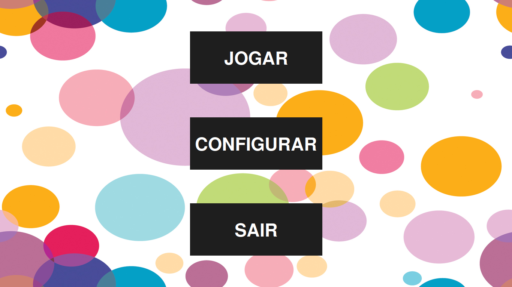

# behavioral_platform

## ENGLISH PRESENTATION
This repository refers to a collaborative project with professor Emerson Ferreira da Costa Leite (PUC-SP). I have developed a local platform that allows the collection of characteristics and behaviour patterns of users, which is employed to conduct studies and research in the field of Psychology.

Overall, the platform presents a game, which allows behavioural information collection.
The platform implements:
* The play mode with:
** 3 distinct experiments.
** Each experiment with 4 stages.
* Complete setting:
** You can change all the standard and game behaviour within this screen.
** You can adjust texts and player's reinforcement to suit your experiment aim. 
* Game log:
** The platform offers a complete game log for further analysis in the CSV format.

PS: The platform is entirely in Portuguese due to the application purposes (in Brazil).

## APRESENTAÇÃO EM PORTUGUÊS
Este repositório se refere a um projeto colaborativo com o professor Emerson Ferreira da Costa Leite (PUC-SP). Eu desenvolvi uma plataforma local que permite a coleta de características e padrões de comportamento dos usuários, que é empregada para realizar estudos e pesquisas na área de Psicologia.

No geral, a plataforma apresenta um jogo que permite a coleta de informações comportamentais.
A plataforma implementa:
* O modo de reprodução com:
** 3 experiências distintas.
** Cada experimento com 4 etapas.
* Configuração completa:
** Você pode alterar todo o comportamento padrão e de jogo nesta tela.
** Você pode ajustar os textos e o reforço do jogador para se adequar ao objetivo do seu experimento.
* Registro do jogo:
** A plataforma oferece um registro completo do jogo para análises adicionais no formato CSV.
